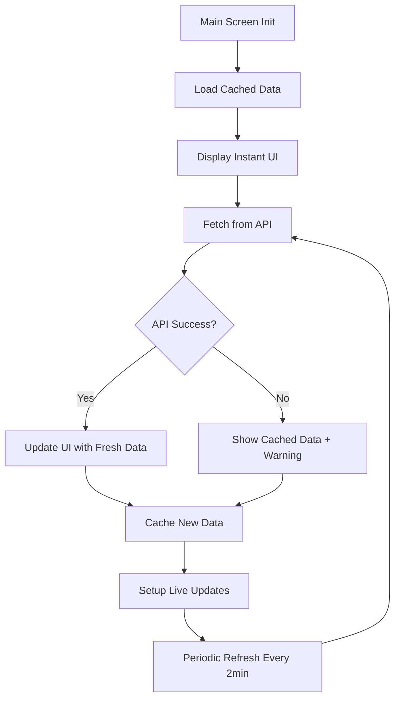

# МОДУЛЬ 3: Главный экран (Main Screen Module)

## 📱 Обзор

Модуль главного экрана - это центральная точка входа в приложение MITA после аутентификации. Он предоставляет пользователю комплексный обзор его финансового состояния, включая текущий баланс, дневные цели по бюджету, недавние транзакции и AI-инсайты.

## 🎯 Основные функции

### 1. **Dashboard Overview**
- **Текущий баланс**: Отображение доступных средств пользователя
- **Дневные расходы**: Сумма потраченная сегодня
- **Оставшийся бюджет**: Автоматический расчет остатка

### 2. **Budget Targets (Дневные цели)**
- Категоризированные бюджетные цели по категориям:
  - 🍔 Food & Dining
  - 🚗 Transportation
  - 🎬 Entertainment
  - 🛍️ Shopping
  - 🏥 Healthcare
  - ⚡ Utilities
- Прогресс-бары для каждой категории
- Цветовые индикаторы состояния (зеленый/желтый/красный)
- Иконки для визуальной идентификации

### 3. **Weekly Overview (Недельный обзор)**
- Мини-календарь последних 7 дней
- Статус каждого дня:
  - ✅ Good (в пределах бюджета)
  - ⚠️ Warning (приближается к лимиту)
  - ❌ Over (превышен бюджет)

### 4. **Recent Transactions**
- Последние 10 транзакций
- Информация о каждой транзакции:
  - Сумма
  - Категория
  - Описание
  - Время (относительное: "2h ago", "1d ago")
  - Иконка категории

### 5. **AI Insights Preview**
- Персонализированные финансовые инсайты
- Умные рекомендации на основе поведения
- Мотивационные сообщения

### 6. **Quick Actions**
- Кнопка "Add Expense" (FloatingActionButton)
- Быстрая навигация к другим экранам
- Refresh данных (pull-to-refresh)

## 🏗️ Архитектура

### Backend Components

#### 1. **Dashboard API** (`/api/dashboard`)

**Endpoint**: `GET /api/dashboard`

**Ответ**:
```json
{
  "status": "success",
  "data": {
    "balance": 2500.00,
    "spent": 45.50,
    "daily_targets": [
      {
        "category": "Food & Dining",
        "limit": 100.00,
        "spent": 25.50,
        "icon": "restaurant",
        "color": "#4CAF50"
      }
    ],
    "week": [
      {
        "day": "Mon",
        "status": "good",
        "spent": 75.00,
        "budget": 100.00
      }
    ],
    "transactions": [
      {
        "id": "uuid",
        "amount": 25.50,
        "category": "food",
        "action": "Lunch at Cafe",
        "date": "2025-10-22T12:30:00Z",
        "icon": "restaurant",
        "color": "#4CAF50"
      }
    ],
    "insights_preview": {
      "text": "Great job! Only 45% of budget used.",
      "title": "Excellent"
    },
    "user_income": 3000.00
  }
}
```

**Функциональность**:
- Вычисление текущего баланса на основе дохода и расходов
- Получение дневных планов из `DailyPlan` таблицы
- Агрегация расходов по категориям
- Генерация недельной статистики
- Создание персонализированных инсайтов

#### 2. **Quick Stats API** (`/api/dashboard/quick-stats`)

**Endpoint**: `GET /api/dashboard/quick-stats`

**Ответ**:
```json
{
  "status": "success",
  "data": {
    "monthly_spending": 1500.00,
    "daily_average": 68.18,
    "top_category": {
      "name": "Food",
      "amount": 450.00
    },
    "savings_rate": 50.0,
    "savings_amount": 1500.00
  }
}
```

### Frontend Components

#### 1. **Main Screen** (`lib/screens/main_screen.dart`)

**State Management**:
```dart
class _MainScreenState extends State<MainScreen> {
  Map<String, dynamic>? dashboardData;
  Map<String, dynamic>? latestAdvice;
  Map<String, dynamic>? userProfile;

  bool isLoading = false;
  String? error;

  IncomeTier? _incomeTier;
  double _monthlyIncome = 0.0;

  final OfflineFirstProvider _offlineProvider;
  final LiveUpdatesService _liveUpdates;
  final BudgetAdapterService _budgetService;
}
```

**Ключевые методы**:

- `_initializeOfflineFirst()`: Инициализация offline-first loading
- `_loadProductionBudgetData()`: Загрузка данных с production budget engine
- `refreshData()`: Обновление данных по запросу пользователя
- `_buildBalanceCard()`: Отрисовка карточки баланса
- `_buildBudgetTargets()`: Отрисовка дневных целей
- `_buildMiniCalendar()`: Недельный календарь
- `_buildRecentTransactions()`: Список транзакций

#### 2. **API Service** (`lib/services/api_service.dart`)

**Dashboard Method**:
```dart
Future<Map<String, dynamic>> getDashboard({double? userIncome}) async {
  // 1. Try new dedicated /api/dashboard endpoint
  // 2. Fallback to legacy calendar/shell approach
  // 3. Transform data to expected format
}
```

**Features**:
- Automatic fallback to legacy endpoints
- Secure token storage
- Comprehensive error handling
- Timeout management

#### 3. **Budget Adapter Service** (`lib/services/budget_adapter_service.dart`)

Адаптер между production budget engine и UI:
```dart
class BudgetAdapterService {
  Future<Map<String, dynamic>> getDashboardData();
  Future<List<Map<String, dynamic>>> getCalendarData();
  Future<Map<String, dynamic>> getBudgetInsights();
}
```

#### 4. **Offline First Provider** (`lib/services/offline_first_provider.dart`)

Обеспечивает работу приложения в offline режиме:
- Кеширование dashboard данных
- Фоновая синхронизация при подключении
- Instant UI с cached данными

#### 5. **Live Updates Service** (`lib/services/live_updates_service.dart`)

Real-time обновления данных:
- Periodic polling (каждые 2 минуты)
- Stream-based data updates
- Automatic refresh при новых транзакциях

## 🎨 UI/UX Features

### 1. **Loading States**
- ✅ Instant UI с cached данными
- ⏳ Subtle loading indicators
- 🔄 Pull-to-refresh
- ⚡ Background sync без блокировки UI

### 2. **Error Handling**
- 🔴 Network error state
- 📝 Incomplete profile state
- ⚠️ Fallback data при ошибках
- 🔁 Retry mechanisms

### 3. **Empty States**
- 📊 "No transactions" message
- 💡 Guidance для новых пользователей
- 🎯 Call-to-action для добавления данных

### 4. **Responsive Design**
- 📱 Адаптивная верстка для разных размеров экранов
- 🎨 Поддержка темной темы
- ♿ Accessibility support

### 5. **Animations**
- ✨ Smooth transitions между состояниями
- 📈 Animated progress bars
- 💫 Subtle micro-interactions

## 🔄 Data Flow



## 📊 Performance Optimizations

### 1. **Offline-First Architecture**
- Instant UI rendering с cached данными
- Нет blocking network calls при запуске
- Background sync не влияет на UX

### 2. **Efficient Data Loading**
- Single comprehensive endpoint (`/api/dashboard`)
- Reduced number of API calls
- Optimized SQL queries в backend

### 3. **Smart Caching**
- Multi-level caching strategy
- Automatic cache invalidation
- Compressed data storage

### 4. **Lazy Loading**
- IndexedStack для tab navigation
- Сохранение state между переключениями
- Efficient memory management

## 🧪 Testing

### Unit Tests
```dart
// lib/services/__tests__/api_service_test.dart
test('getDashboard returns valid data', () async {
  final service = ApiService();
  final data = await service.getDashboard();

  expect(data['balance'], isNotNull);
  expect(data['spent'], isNotNull);
  expect(data['daily_targets'], isA<List>());
});
```

### Widget Tests
```dart
// lib/screens/__tests__/main_screen_test.dart
testWidgets('Main Screen displays dashboard data', (tester) async {
  await tester.pumpWidget(MainScreen());

  expect(find.text('Current Balance'), findsOneWidget);
  expect(find.byType(FloatingActionButton), findsOneWidget);
});
```

### Integration Tests
```dart
// integration_test/main_screen_flow_test.dart
testWidgets('Complete main screen user flow', (tester) async {
  // 1. Login
  // 2. Navigate to main screen
  // 3. Verify dashboard loads
  // 4. Add expense via FAB
  // 5. Verify dashboard updates
});
```

## 🔒 Security Considerations

### 1. **Authentication**
- JWT tokens для всех API calls
- Automatic token refresh
- Secure token storage

### 2. **Data Privacy**
- Encrypted local storage
- No sensitive data in logs
- GDPR compliant data handling

### 3. **Input Validation**
- Server-side validation
- SQL injection prevention
- XSS protection

## 📈 Analytics & Monitoring

### Tracked Events
- `main_screen_view` - Screen view count
- `dashboard_load_time` - Performance metric
- `dashboard_error` - Error tracking
- `budget_target_click` - User engagement
- `add_expense_fab_click` - Action tracking

### Performance Metrics
- API response time: Target < 200ms
- Screen load time: Target < 1s with cached data
- Memory usage: Target < 100MB
- Crash rate: Target < 0.1%

## 🚀 Future Enhancements

### Planned Features
- [ ] Widgets для home screen
- [ ] Swipe actions на транзакциях
- [ ] Customizable dashboard layout
- [ ] Advanced filtering
- [ ] Export dashboard data
- [ ] Dark mode optimizations
- [ ] Voice commands для quick actions
- [ ] AI-powered spending predictions
- [ ] Social sharing features
- [ ] Gamification elements

### Performance Improvements
- [ ] GraphQL migration для efficient data fetching
- [ ] WebSocket для real-time updates
- [ ] Image lazy loading
- [ ] Incremental data loading
- [ ] Advanced caching strategies

## 📝 Development Guidelines

### Adding New Dashboard Widgets

1. **Backend**: Add data to dashboard endpoint
```python
# app/api/dashboard/routes.py
@router.get("")
async def get_dashboard():
    return success_response({
        # ... existing data
        'new_widget_data': compute_widget_data()
    })
```

2. **Frontend**: Create widget component
```dart
// lib/widgets/new_widget.dart
Widget _buildNewWidget() {
  final data = dashboardData?['new_widget_data'];
  return Card(/* ... */);
}
```

3. **Integration**: Add to main screen
```dart
// lib/screens/main_screen.dart
Column(
  children: [
    // ... existing widgets
    _buildNewWidget(),
  ],
)
```

### Customizing Budget Categories

Edit category configuration:
```dart
// lib/services/budget_adapter_service.dart
final category_icons = {
  'new_category': Icons.new_icon,
};

final category_colors = {
  'new_category': Color(0xFFHEXCODE),
};
```

## 🐛 Troubleshooting

### Common Issues

**1. Dashboard not loading**
- Check authentication token
- Verify backend is running
- Check network connectivity
- Review logs for errors

**2. Data not refreshing**
- Check Live Updates Service
- Verify pull-to-refresh works
- Check cache invalidation

**3. Incorrect balance calculation**
- Verify user income is set
- Check transaction data integrity
- Review budget calculation logic

## 📚 Related Documentation

- [API Documentation](API_DOCUMENTATION.md)
- [Budget Engine Documentation](BUDGET_ENGINE.md)
- [Authentication Flow](AUTHENTICATION.md)
- [Offline-First Architecture](OFFLINE_FIRST.md)
- [Testing Guidelines](TESTING.md)

## 👥 Contributors

- **Backend**: Dashboard API, Budget calculations
- **Frontend**: Main Screen UI, Data integration
- **UX**: Design system, Animations
- **QA**: Testing, Performance optimization

## 📄 License

Proprietary - YAKOVLEV LTD © 2025

---

**Last Updated**: January 2025
**Version**: 1.0.0
**Status**: ✅ Production Ready
